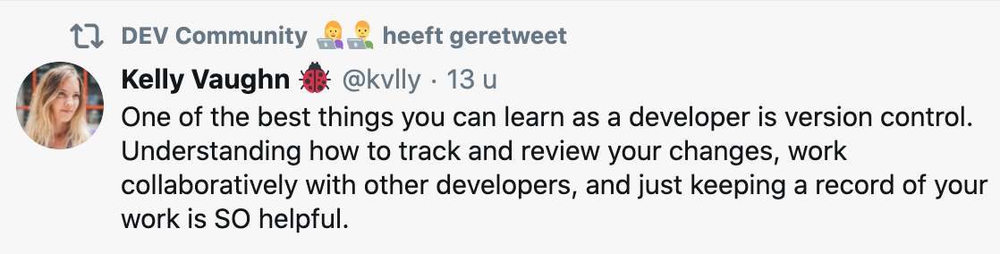

# The very own BeCode git guide

- Specific commit messages
- Aim for working versions to be in a commit
- Commit per feature
- Check your code just before comitting
- Starting with a capital letter
- Use present-tense instead of past tense (ex: "Add header" instead of "Added header")

## Am I prepared to commit? 📋️
- Commit early, commit often
- Do a small cleanup/checkup of your code before you commit
- Double check what folder you are doing the commit in
- Commit per feature / topic
- Check which branch you are working in

## I'm so ready for this - now what? 🤔
- Don't forget any step: add, commit, pull, push
- Git status is your friend
- Use the Github instructions as a guideline

## Is "grmblr missing semicolon 💀" a good commit message?
- Write a specific message (think of search at a later stage)
- Use the imperative form
- Start with a capital letter
- Use a description for longer texts (leave one blank line between title and description)
- Prefix with `WIP` (work in progress) if any unfinished work goes into the repository
- Example: `added fix` 🤔 --> `Add fix for header spacing on Internet Explorer` 🥳

