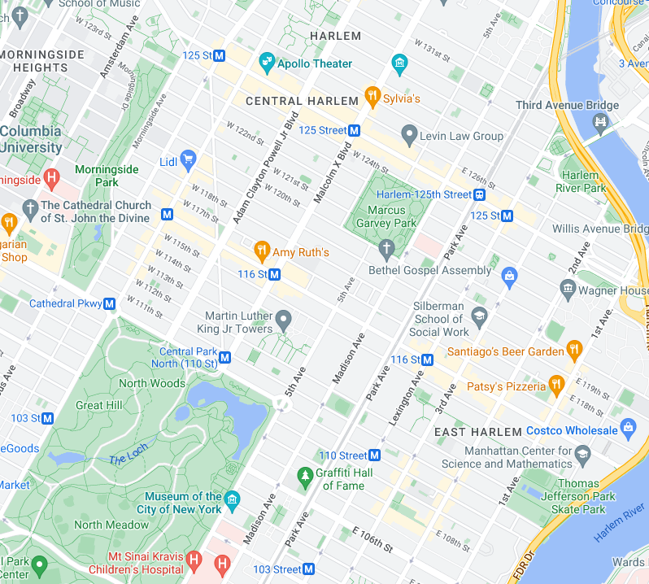

# The Manhattan distance

> Want to go to the Empire state building ? Just take the avenue on left cross 10 streets, then turn right for 2 avenues and you're there.

Many cities in the United States are built using a grid system, most notably the island of Manhattan was designed with `streets` parallel to each other and `avenues` perpendicular, hence effectively dividing the city into blocks. This is extremely useful for anyone to give directions to lost strangers.



This oddity gave birth to what mathematicians now call : "The Manhattan Distance" or ["Taxicab Geometry"](https://en.wikipedia.org/wiki/Taxicab_geometry) a way to express distance in terms of a sum of x-distance and y-distance


*Point A is 5 blocks away from Point B*

## The algorithm

Design a function `manhattan` that takes 4 arguments `streetA` & `avenueA` (the starting point in terms of street and avenue), `streetB` & `streetB` (the ending point in terms of street and avenue) and computes the number of blocks between two points.

ex:

```js
// going from 1st street/1st avenue to 2nd street/2nd avenue
manhattan(1, 1, 2, 2); // returns 2

manhattan(1, 1, 1, 1); // return 0

manhattan(5, 4, 3, 2); // returns 4
```
