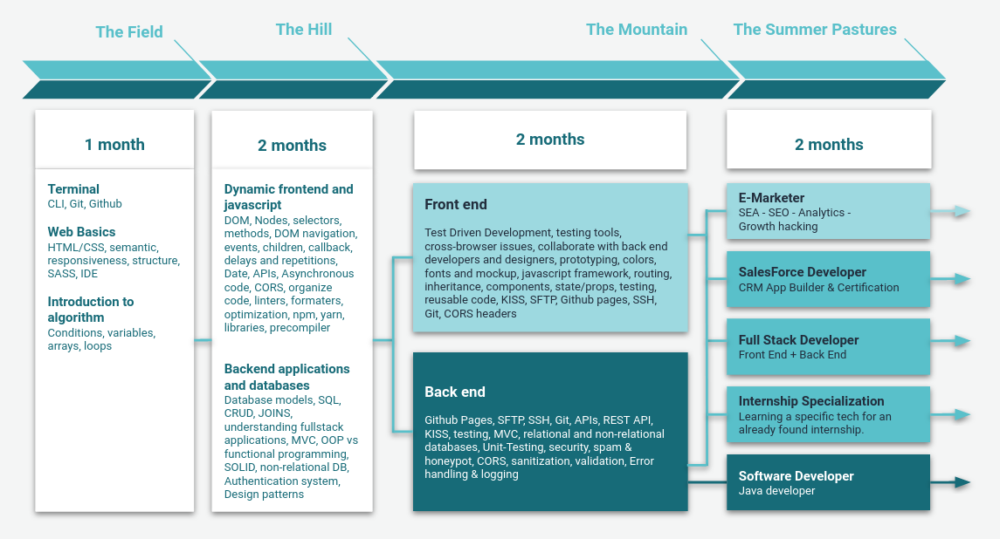

# CRL-Wilson-2

Ce repo concerne ton activité à BeCode : briefings, parcours, etc.
Clone-le sur ton ordi et `git pull` régulièrement afin de rapatrier les mises à jour.

## Tes sources d'information pour respecter les règles de BeCode

1. Lis le [contrat pédagogique](https://github.com/becodeorg/BeCode/blob/master/educationalcontract.md).
1. Le [Wiki de BeCode](https://github.com/becodeorg/BeCode/wiki)

## Retards et absences

En cas de retard, d'absence ou de départ anticipé (que ça soit prévu ou pas du tout), préviens-nous le plus tôt possible.

Dans l'ordre :

- Tu envoies un email rédigé professionnellement à **angelique.joniaux@becode.org** et à tes coachs **charleroi@becode.org** en copie du mail.
- Document justificatif, envoie-le dès que possible via [my.becode](https://my.becode.org/dashboard)
- Pas de justificatif ? Dis-le nous explicitement.

[Petit rappel](https://github.com/becodeorg/BeCode/blob/master/contratpedagogique.md#sanctions) :

- 2 retards non justifiés seront comptabilisés comme une absence;
- 2 absences entraîneront une convocation en entretien individuel;
- 6 absences non justifiées entraîneront une exclusion définitive.
- Si le taux d'absence (justifiée ou non) du junior dépasse 20%, BeCode pourra unilatéralement décider de mettre fin à son contrat.

## Télétravail

- Lors des journées de télétravail, tu travailles **à ton domicile** 
- Tu restes joignable sur Gather & Discord pendant toute la journée. 

## Contenus pédagogiques

- [TRAIL](/1.TRAIL) : les parcours sont un ensemble de tutoriels, alliant théorie et pratique, afin de monter rapidement en compétence.
- [PROJECTS](/2.PROJECTS) : les projets sont conçus pour t'amener à découvrir par toi-même ou en groupe, des problématiques spécifiques du code. Ils servent également, bien sûr, à t'entraîner sur des projets réalistes.
- [FYI](/3.FYI/) : For your information...

## Planning

- 21 / 03 / 2023 : [La prairie (The-Field)](1.TRAIL/01.The-Field/README.md)
- 17 / 04 / 2023 : La colline (The-Hill)
- 15 / 05 / 2023 : La montagne(The-Mountain)
- 19 / 06 / 2023 : Les pâturages
- Octobre 2023 : Début de stage

### Vacances & congés

Il y a 2 blocs de vacances d'une semaine :
- 08 / 05 / 2023 au 13 / 05 / 2023;
- 01 / 08 / 2023 au 05 / 08 / 2023;

Congés légaux :

- Paque: 10 avril 2023
- Ascension: 18 Mai 2023
- Pentecôte: 29 Mai 2023
- Fête Nationale: 21 Juillet 2023
- Assomption: 15 Aout 2023

## Contact

- Lead Coach : **Corentin** / corentin.noirot@becode.org
- Co-Coach : **Arnaud** / arnaud@becode.org
- Career Coach : **David** / david@becode.org
- Marketing : **Stéphanie** / stephanie.vanhoof@becode.org
- Administrative support : **Angélique** / angelique.joniaux@becode.org

Fais egalement un petit tour sur [BeCode.org](https://becode.org/about/team/) pour connaître les différents membres de l'équipe BeCode .

NB : en dehors de quelques exceptions (dont ce readme), l'intégralité du repo est rédigé en anglais. (Pas de panique !!! [#Deepl](https://www.deepl.com/translator))
